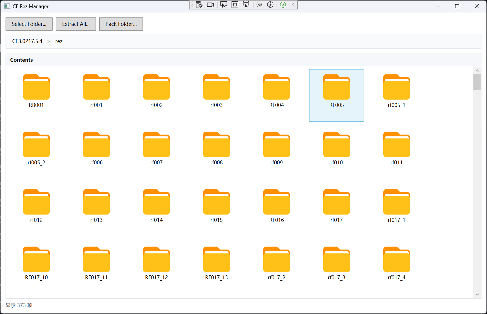
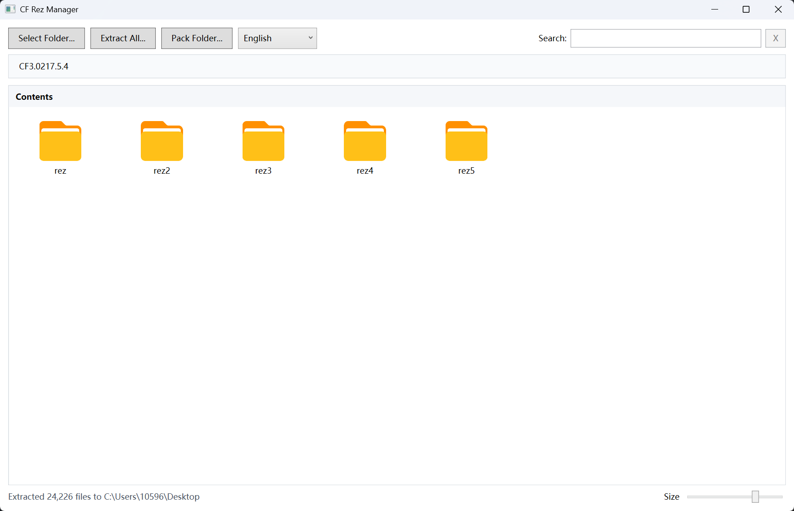
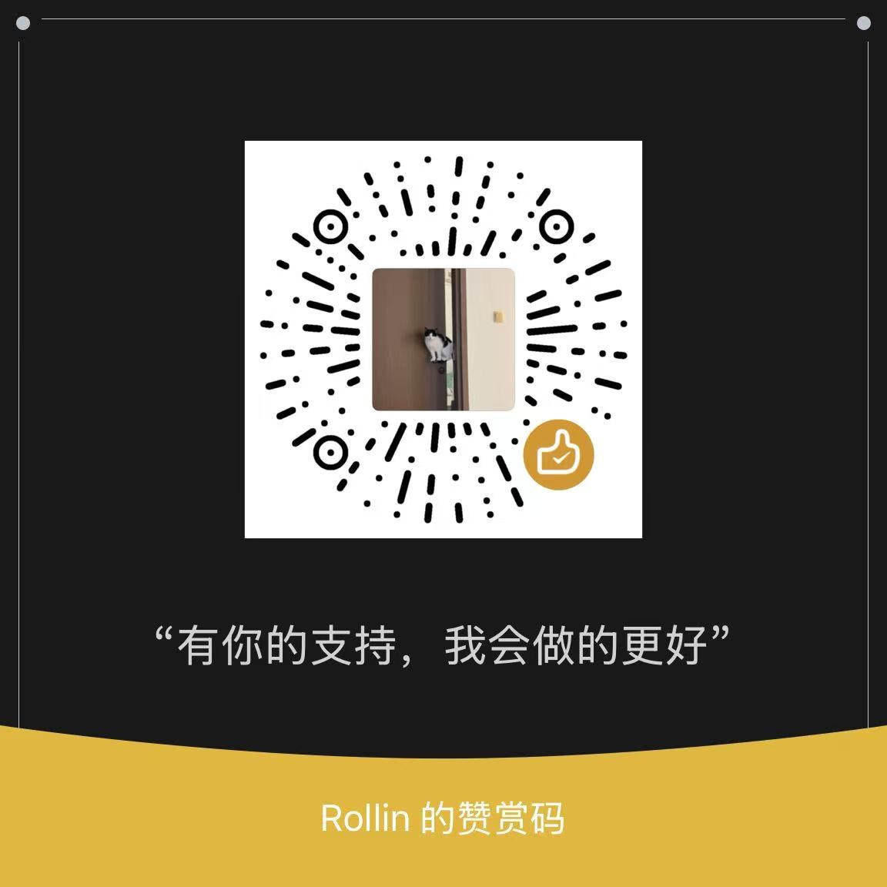

# CF Rez Manager

English documentation is available in [README.en.md](README.en.md).




CF Rez Manager 是一个 Windows WPF 工具，用来浏览、搜索、预览、解包和重新打包 LithTech / CrossFire 的 `.rez` 资源包，也能直接查看已解包目录里的散文件资源。

## 能做什么

- 浏览 `.rez` 包、REZ 内部目录和普通资源文件夹。
- 搜索文件、目录和 REZ 内部路径，支持多关键词筛选。
- 批量导出全部资源，也可以只导出选中的文件、目录或 REZ 项。
- 将普通 Windows 文件夹重新打包为 `.rez`。
- 预览图片、纹理、音频、模型、地图、脚本配置和多种 CrossFire/LithTech 资源。
- 把可识别的 CrossFire 图片 BIN 导出为标准 `.png`。
- 提供 OBJ/MTL 模型导出、CFG 扫描和 CFG 解码等命令行批处理入口。

## 环境要求

- Windows
- .NET 8 SDK 或 .NET 8 Runtime

## 构建和运行

```powershell
dotnet build .\CFRezManager.csproj
```

可以从 Visual Studio 运行，也可以启动构建后的程序：

```text
bin\Debug\net8.0-windows7.0\CFRezManager.exe
```

## 基本使用

1. 启动程序。
2. 选择包含 `.rez` 文件或散文件资源的文件夹。
3. 双击文件夹、REZ 包、REZ 内部目录或支持预览的文件。
4. 用顶部面包屑返回上级或跳转到任意父级位置。

顶部语言选择框可在 `中文` 和 `English` 之间切换。程序会记住语言、视图大小、扫描目录、打包目录、导出目录和保存位置。

搜索框首次输入时会建立内存索引，之后可快速筛选已扫描到的文件、目录和 REZ 内部路径。多个关键词用空格分隔时，需要全部命中才会显示结果。

右下角 `大小` 滑条用于切换列表视图和平铺图标视图。鼠标悬停在项目上时，会显示类型、路径、大小、来源、MD5、偏移等信息。

右键菜单常用操作：

- `定位到文件`：从搜索结果跳回文件所在目录并选中它。
- `复制名称`：复制单个或多个选中项名称。
- `导出此项...` / `导出 N 个选中项...`：导出选中的文件、目录或 REZ 项。
- `解码 BANK...`：导出 decoded bank 和原始 FSB5 音频块。

## 预览能力

- 图片和纹理：PNG、JPG、BMP、GIF、TIFF、DDS、TGA、DTX、CrossFire 图片 BIN，支持原始尺寸预览和上一张/下一张切换。
- 压缩资源：支持常见 LZMA 外壳资源，缩略图角标会标出 `RAW`、`LZMA`、`DXT`、`TXT` 等状态。
- 音频：WAV、OGG、MP3 和 FMOD `.bank`，支持波形缩略图、曲目列表、播放控制、进度拖动和动态频谱。
- 模型和地图：LTC、LTB、LTA、DAT、SPR，可生成缩略图并打开独立预览窗口；SPR 可自动播放动画帧。
- 文本和配置：CFT、FCF、FXF、FXO、NAV、APF、REF、TXT、部分 WAVE 资源、CrossFire UI 脚本 `.bin`、CFG。
- CFG 批处理：可扫描贴图引用，分类失败解码结果，并为二进制 RGB 条带型 CFG 生成预览。

生成过的缩略图会缓存在当前 Windows 用户目录下。资源变化后可用 `清缩略图` 清理旧缓存。

## 模型预览操作

- 鼠标左键点击模型窗口：进入自由视角。
- 鼠标移动：调整视角方向。
- `W` / `A` / `S` / `D`：前后左右移动。
- `Shift`：加速移动。
- 鼠标滚轮：沿当前视线方向前进或后退。
- 鼠标右键或 `Esc`：退出自由视角。
- `Reset View`：重置相机位置和方向。

## 解包资源

点击 `全部导出...` 可导出当前扫描范围内所有 REZ 包中的文件。

只导出指定项目：

1. 选中文件、文件夹、REZ 包或 REZ 内部目录。
2. 需要多选时按住 `Ctrl` 或 `Shift`。
3. 右键选中项。
4. 选择 `导出此项...` 或 `导出 N 个选中项...`。
5. 选择输出文件夹。

导出的文件会保留 REZ 内部目录结构。可识别的 CrossFire 图片 BIN 会导出为 `.png`；脚本或配置类 BIN 会按原始 `.bin` 导出。

## 打包为 REZ

点击 `打包文件夹...` 可把普通 Windows 文件夹打包为新的 `.rez` 文件。

1. 准备一个包含目标文件和子目录的文件夹。
2. 点击 `打包文件夹...`。
3. 选择源文件夹。
4. 选择输出 `.rez` 路径。

说明：

- 文件数据在 REZ 中直接存放。
- REZ 目录表会被加密，文件 MD5 会重新计算。
- 文件名和目录名目前要求为 ASCII。
- 文件扩展名需要为 1 到 4 个字符。
- 新包会保留内容和目录结构，但不会复制原包的字节级布局、偏移、时间戳或整包 MD5。

## 命令行工具

```powershell
dotnet run --project .\CFRezManager.csproj -- --export-obj --root "F:\Game\CrossFire" --model "PV-AK47_Balance" --output ".\out\PV-AK47_Balance.obj"
dotnet run --project .\CFRezManager.csproj -- --scan-cfg --root "C:\Extracted\cfg"
dotnet run --project .\CFRezManager.csproj -- --decode-cfg --root "C:\Extracted\cfg"
```

- `--export-obj`：导出 LithTech 模型为 OBJ/MTL，并生成贴图和映射报告。
- `--scan-cfg`：扫描 CFG，提取贴图引用，输出 TXT/CSV 报告。
- `--decode-cfg`：重试失败 CFG，导出可还原文本或二进制预览图，并分类高熵配置。

## 制作不易，鼓励一下

<div align="center">

### 感谢这些朋友的支持

<table>
  <tr>
    <td align="center" width="220">
      <strong>黑猫不是警长</strong><br />
      <sub>打赏 20</sub>
    </td>
    <td align="center" width="220">
      <strong>KissJoJo</strong><br />
      <sub>打赏 100</sub>
    </td>
  </tr>
</table>

<sub>名单按收到支持的时间记录。感谢你们让这个小工具继续往前走。</sub>

如果这个工具帮到了你，可以请我喝杯咖啡。



</div>
